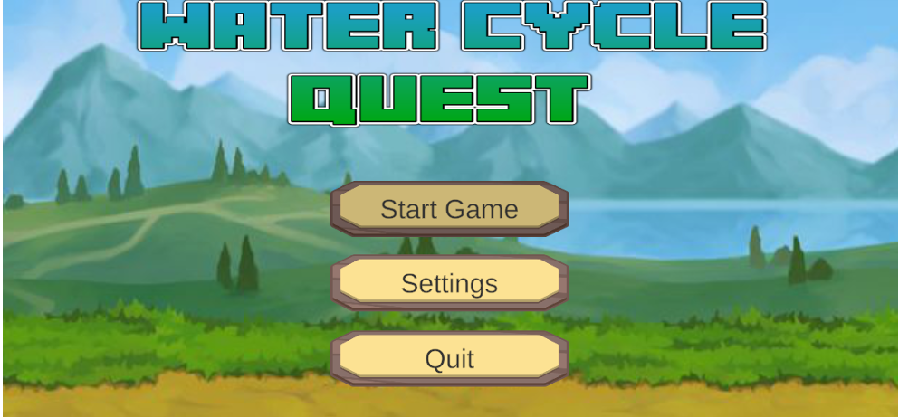
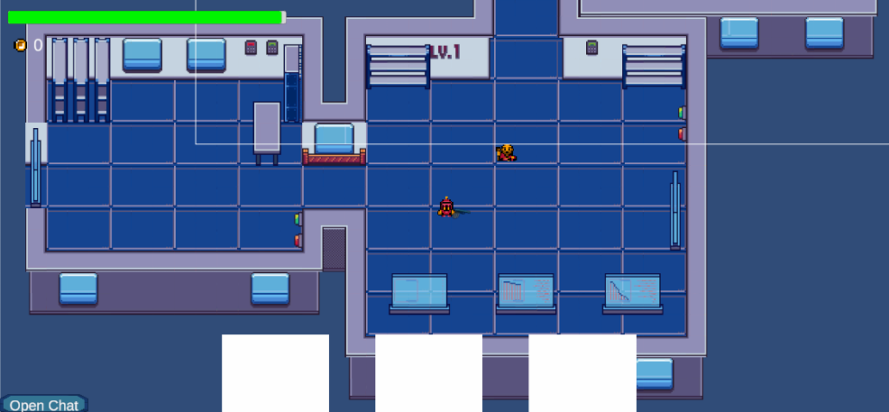
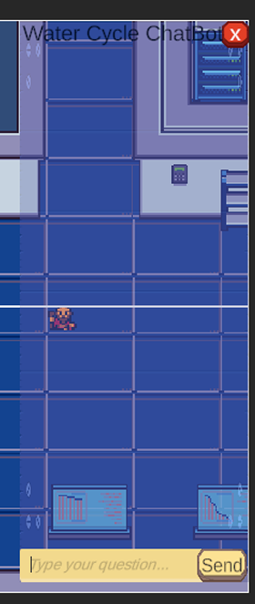
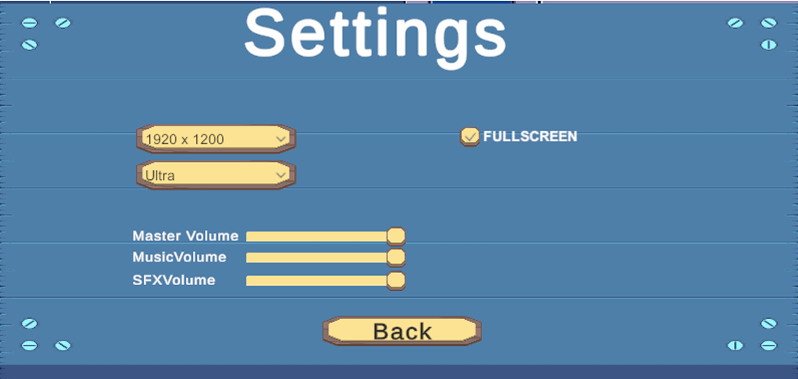

# 🌊 WaterCycleQuest  
### An Educational Unity Game Powered by LLM-Based NPC Dialogue

WaterCycleQuest is an interactive 3D educational game designed for children aged **8–12**, teaching the **water cycle**, **pollution**, and **water conservation** through puzzles, storytelling, and NPC interactions.

This project was developed using **Unity (2022.2.21f1)** with a custom **Flask API + LLM** integration to provide intelligent NPC dialogue, hints, and educational explanations.

---

## 🎮 Game Features

### 🌊 1. Core Gameplay
- Player solves puzzles by switching between **two characters** with unique abilities.
- Transform water between **ice → liquid → vapor** for puzzle mechanics.
- Levels follow **seasonal progression** (spring, summer, fall, winter).
  
### 🤖 2. AI-Powered NPC Helper  
- Custom-built **Flask server** hosting an LLM.
- Unity communicates via API to generate:
  - Hints
  - Explanations about water cycle
  - Feedback on quiz questions

### ♻️ 3. Environmental Education
- Teaches:
  - Evaporation, condensation, precipitation  
  - Water pollution & purification  
  - Conservation techniques  

### 🔀 4. Procedural Generation
- Certain puzzle elements generate dynamically for unique playthroughs.

### 👥 5. Co-Op or Single Character-Swap Mode
- Solo mode: switch between the two characters  
- Co-op: two players coordinate together  

---

## 🧠 Tech Stack

| Component | Technology |
|----------|------------|
| Game Engine | Unity 2022.2.21f1 |
| Language | C# |
| AI System | Python + Flask API |
| AI Model | Local or remote LLM (OpenAI or HuggingFace compatible) |
| NLP Features | Dialogue generation, tutoring, hint system |
| Tools | Blender (3D modeling), GitHub, Unity Asset Management |

---

## 🧩 Architecture Overview

```
Unity Scene
   ↓ HTTP POST/GET
Flask Server (API)
   ↓
LLM Model (Chat-based)
   ↓
JSON Response
   ↓
Unity NPC Dialogue UI
```

---

## 🚀 How to Run

### 🔧 Unity Side  
1. Open project in **Unity 2022.2.21f1**  
2. Import required assets  
3. Press **Play**  

### 🔧 Flask + LLM Side  
```
pip install flask openai
python app.py
```

Update your Unity script with your local API endpoint:
```
http://127.0.0.1:5000/message
```

---

## 📸 Screenshots  





---

## 📝 Future Improvements
- Add voice recognition  
- Arabic/Persian/Turkish localized dialogue  
- More levels & seasonal mechanics  
- Cloud-based AI for low-end devices  

---

## 📚 Educational Impact  
This game supports:
- Schools  
- Environmental programs  
- Home learning  
- NGOs focusing on water conservation  

---

## 📄 License  
This project is licensed under the [MIT License](LICENSE) – see the LICENSE file for details.

